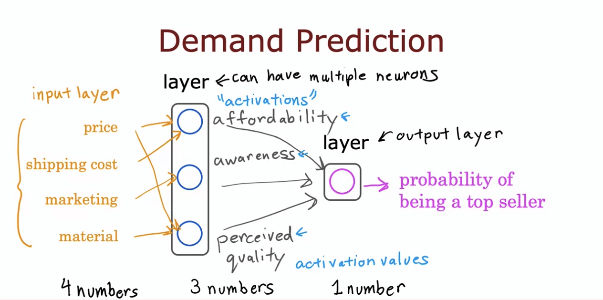
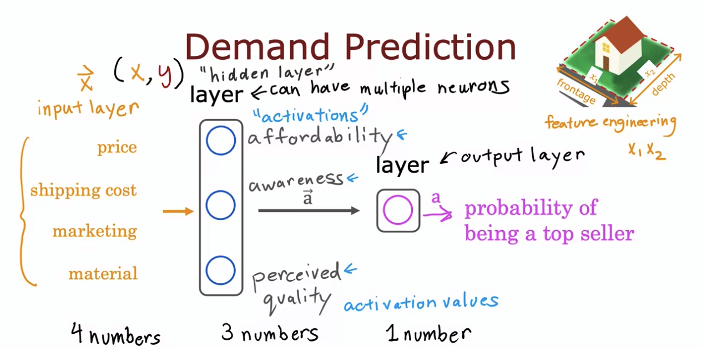
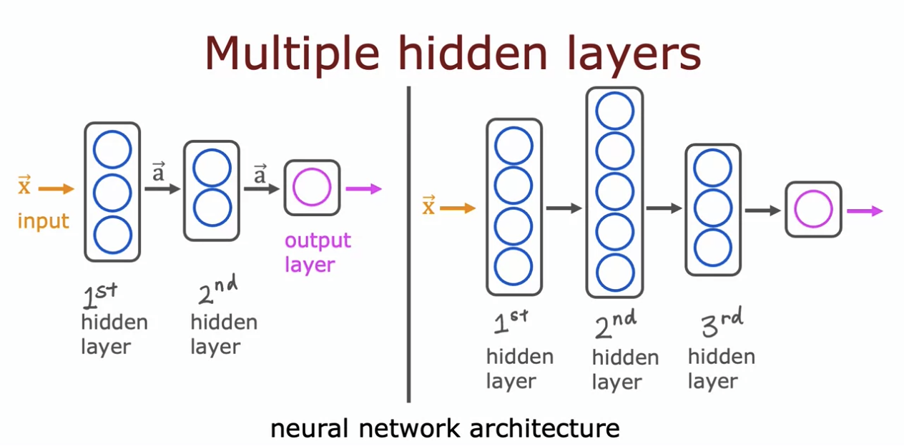

# Introduction

Below are some rough notes from Stanford Online's Advanced Learning Algorithms course. They're not in any particular formatting and are purely rough bullet points on important concepts. 

# W1 Lectures

## Neurons and the brain

- Neural networks
  - Origins: Algorithms that try to mimic the brain
  - Used in the 1980's and early 1990's.
  - Fell out of favor in the late 1990's.
  - Resurgence from around 2005.

  - Areas with large impact:
    - Speech recognition
    - Computer vision / Image recognition
    - Text (NLP)

- How does the brain work?
  - Given a neuron in the brain, it has a number of inputs where it receives electrical impulses from other neurons. The neuron carrys out some form of computation and send the outputs to other neurons by electrical impulses.

- Biological Analogy
  - The biological neuron takes some sort of inputs, has a cell body and nucleus, and transfers the output to another neuron through an axon.
  - The simplified mathematical model of a neuron takes in some inputs (numbers), performs computation, and outputs another number (which could be used as input in another neuron).

- If deep learning has been around for so long, why is it just now becoming popular?
  - TLDR: There wasn't enough data before. Now that big data has emerged and we have data out the wazoo, we're seeing larger and larger neural networks that can do cool sh*t.

## Demand Prediction

- Example (Demand Prediction): You look at a product and try to predict, will this product be a top seller or not?

- Building a Single Neuron
  - Takes inputs (ex. price)
  - Similarly to logistic regression before we said the output $f(x) = 1/(1 + e^{-(wx + b)})$ but now we'll say that this is $a$ meaning **activation**.
  - It takes the price and outputs the probability of being a top seller.

- Now let's say we have multiple features:
  - Price
  - Shipping cost
  - Marketing
  - Material

- Let's say consumers judge an item off of three factors: affordability, awareness, and perceived quality.
- Call these activations
- Each activation takes as input some of the features. Maybe affordability requires price. Maybe perceived quality (for better or for worse) requires price as well as material since people naturally assume higher priced goods are of higher quality.

- Adding all of these features individually is really tedious so in practice what we do is **allow every neuron to have access to every feature from the previous layer**.

- Not looking at the input layer, this is basically the same as logistic regression with the 3 inputs (activations) and single ouput.
- Neural networks are very similar to logistic regression but with the ability to learn its own features, which features are important, and the ability to engineer features for itself. Whereas before we had to do it manually.

### Multiple hidden layers

- The question of how many layers your neural network should have is a question of the **architecture of the neural network**.
- The number of hidden layers and number of hidden units per layer can have an impact on the performance of your neural network.

