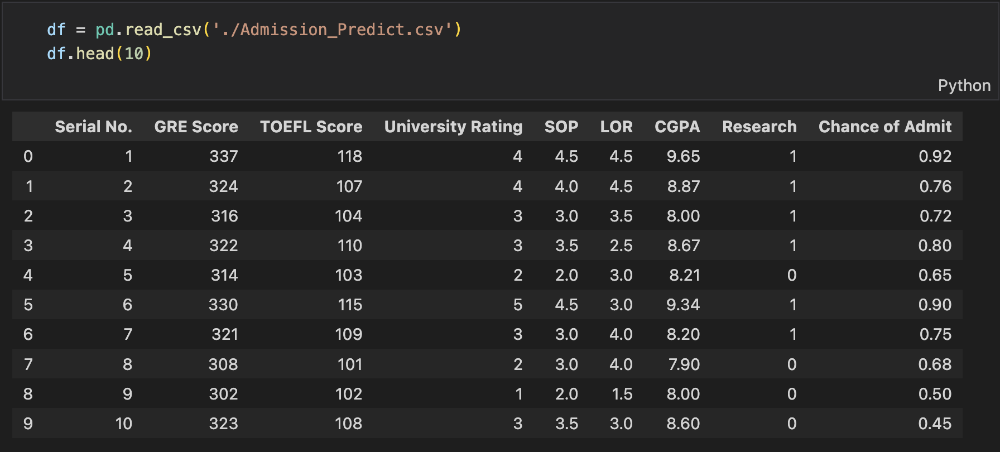
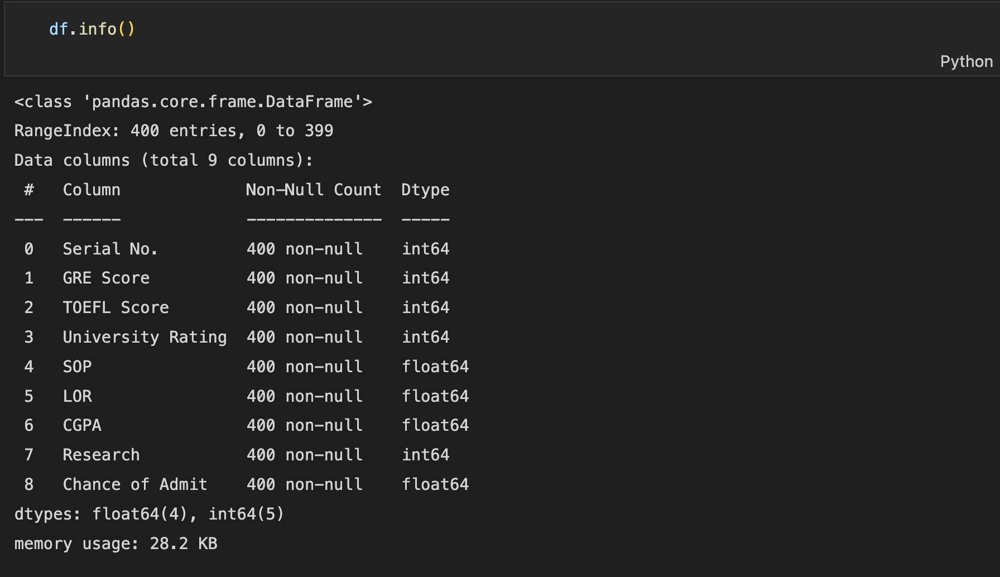
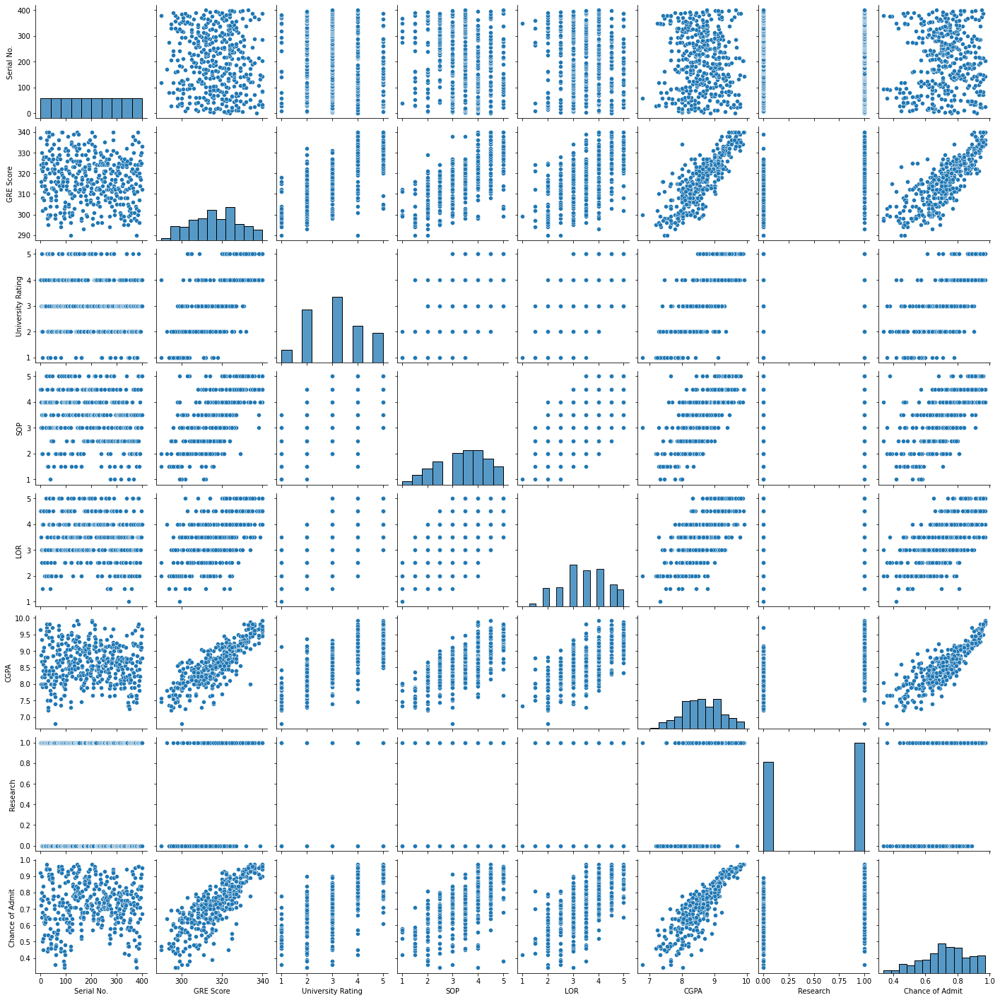
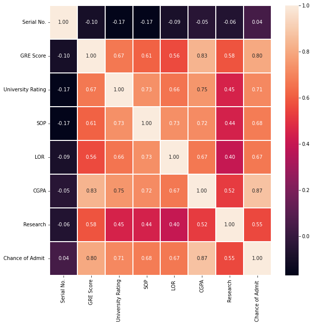
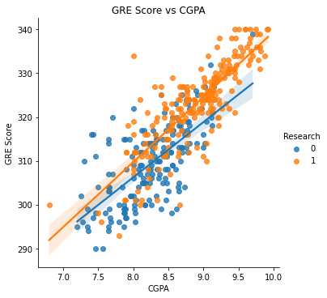
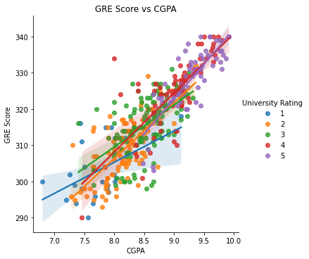
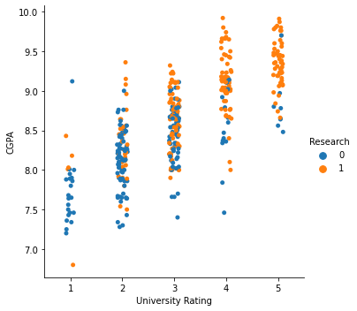
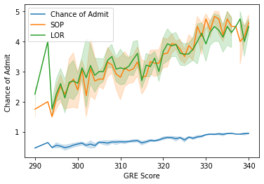

Multiple linear regression is a regression model that estimates a target value given multiple input features. 
The intuition behind multiple linear regression is similar to univariate regression but with the weights represented as a vector as opposed to
a single `w` value.

This post covers some exploratory analysis on the dataset that we'll be using. The next post will touch on some of the math behind MSE, gradient descent, and the implementation for multiple linear regression from scratch.

# Problem Statement

A friend came to you in a state of panic telling you that they did poorly on the GRE. They're saying that they have no chance of getting into any graduate school, that their life is over, and that they might as well give up now and find another career path.

However, being the optimistic and data-oriented friend that you are, you tell your friend that there might be other factors such as a strong letter of rec, high CGPA, or work experience that might help them gain the favour of the admissions office. You begin looking for some data and decide to build a model that predicts the probability of graduate admission based on a number of different factors.

# The Data

The data we'll be using is a public dataset available [here](https://www.kaggle.com/datasets/mohansacharya/graduate-admissions). It includes the
following features and target probability (Chance of Admit):

- GRE Scores ( out of 340 )
- TOEFL Scores ( out of 120 )
- University Rating ( out of 5 )
- Statement of Purpose and Letter of Recommendation Strength ( out of 5 )
- Undergraduate GPA ( out of 10 )
- Research Experience ( either 0 or 1 )
- Chance of Admit ( ranging from 0 to 1 )

# Data Exploration

We'll use some basic pandas functions to examine the dataset, make sure there aren't any null values, and start to get a feel for what we're working with.



Using the functions `describe()` and `info()` we can quickly get an idea of what sort of data we're working with.



Although the data comes with TOEFL scores, this feature isn't quite relevant for this model since we're only trying to model applications within North America (suppose your friend is Canadian and looking only to apply to US grad schools).

The `info()` function provided the basic level of information that we needed but it could also be helpful to check the `shape`, `columns`, and any `isnull()` fields before continuing on. In our case, seaborn provides an easy pairplot to graph the relations between features.

```
sns.pairplot(df)
plt.show()
```



We can also find the correlations between features directly using the pandas `corr()` method and generate a heatmap using the correlations and seaborn. Below, we'll specify the size of the graph, whether or not we want annotations, floating point formatting, and some other aesthetic settings.

```
plt.figure(figsize=(10, 10))
sns.heatmap(df.corr(), annot=True, linewidths=0.05, fmt='.2f', cmap='rocket')
```



# Data Analysis

From the data exploration above, we notice that the Chance of Admit, GRE Score, and CGPA are all linearly related to each other. We can see that students that have high CGPAs tend to score well on the GRE. Since students that have a high CGPA and GRE are likely to do well in a graduate academic environment, they tend to have high admittance rates.

But this is all relatively straightforward. "If you have a high CGPA and GRE Score you'll be likely to gain admittance to a grad school" is a somewhat intuitive statement that doesn't provide us much of an insight.

#### Research Experience

However, our dataset has a feature for undergraduate work experience in Research labs which will be interesting to analyze in relation to the above positively correlated features. Seaborn also has a method that plots linearly related data and includes a best fit line that we'll be using for this purpose.

```
fig = sns.lmplot(x="CGPA", y="GRE Score", data=df, hue="Research")
plt.title("GRE Score vs CGPA")
plt.show()
```



It seems that students who are involved in research tend to have higher CGPAs and GRE Scores. This could be due to superior analysis skills gained in research environments or stronger problem solving skills, although the differences are not too significant.

#### University Rankings

When plotting the same features with respect to a student's University Rating, however, we find some more interesting results.

```
fig = sns.lmplot(x="CGPA", y="GRE Score", data=df, hue="University Rating")
plt.title("GRE Score vs CGPA")
plt.show()
```



Interestingly it seems that coming from a University that is higher in the rankings correlate with higher GRE Scores and CGPA.

On one hand, it makes sense that students who are admitted to stronger universities are probably more studious which would translate to GRE preparation and academic performance. 

But this could also be due to environmental differences related to SES that lead to differences in test performance. Students that attend top universities likely have access to more money, resources, and learning opportunities in comparison to students from drastically lower income brackets.

Students from low SES areas may struggle to access the same level of tutoring and quality of learning that could be the reason for the above disparity.

Below, we can also show the CGPA with respect to University Rating and categorize the results into whether or not the student has Research experience. More prestigious schools often have stronger research programs, more opportunities for student involvement, and more lab positions available to their student body compared to weaker schools.



#### Statement of Purpose vs Letter of Rec

So far we've looked into some of the data behind CGPA, GRE Scores, University Ranking, and Research experience. But what about more subjective
aspects of a graduate application like the statement of purpose or letter of rec? How do these aspects relate to the above features and ultimately to the chance of admittance?

To find out, we can simply plot lines for the Statement of Purpose (SOP) and Letter of Rec (LOR) in relation to GRE Scores for example.

```
sns.lineplot(x="GRE Score", y="Chance of Admit ", data=df,label='Chance of Admit ')
sns.lineplot(x="GRE Score", y="SOP", data=df,label='SOP')
sns.lineplot(x="GRE Score", y="LOR ", data=df,label='LOR ')
plt.legend(loc=2)
plt.show()
```



From the graph above, we can see that students who score well on the GRE tend to also have strong SOPs and LORs. The strength of SOPs and LORs also correlate positively to the chance of admittance so we can definitely say that there's some weight there. How much weight? We'll find out when building our regression model.

# Conclusion

So far we've explored some of the features and how they relate to eachother. In the next post we'll be building a multiple regression model from scratch, applying the info we've gathered here, and executing some predictions on whether or not our friend will find a grad school to get into.

# References

Dataset:
- Mohan S Acharya, Asfia Armaan, Aneeta S Antony : A Comparison of Regression Models for Prediction of Graduate Admissions, IEEE International Conference on Computational Intelligence in Data Science 2019