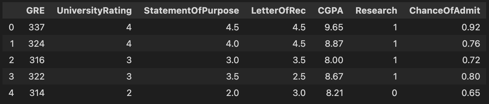
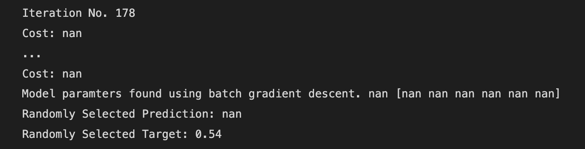

In the previous post: Multiple Linear Regression from Scratch: Data Exploration I touched on some basic data exploration ideas while looking at some of the input features.

In this post, using the same graduate admissions dataset I'll provide an implementation for the computation of cost, gradient descent, and batch gradient descent from scratch using only Python
and NumPy as well as some math :)

# MSE for Univariate Linear Regression

Recall the MSE cost function for univariate linear regression below. Parameters w and b are both scalars since I only have a single input feature.

$$J(w,b) = \frac{1}{2m} \sum\limits_{i = 0}^{m-1} (f_{w,b}(x^{(i)}) - y^{(i)})^2 \tag{1}$$ 
 
- $f_{w,b}(x^{(i)})$ is the prediction for example $i$ using parameters $w,b$.  
- $(f_{w,b}(x^{(i)}) -y^{(i)})^2$ is the squared difference between the target value and the prediction.   
- These differences are summed over all the $m$ examples and divided by `2m` to produce the cost, $J(w,b)$.

# MSE for Multiple Linear Regression

With multiple input features, the training examples are no longer represented as an (m,) ndarray. Instead I now have a matrix with `m` training examples and `n` features per training example.


Where $x^{(i)}$ is a vector containing a set of training examples and $x_j^{(i)}$ represents the jth feature in the $x^{(i)}$th training set.

Our parameter `w` will now also be represented as a vector $\hat{w}$ having n elements representing a `w` parameter for each input feature. `b` is still a scalar parameter for the model.

The regression model's prediction with multiple input features can now be represented as: 

$$
    f_{w,b}(x) = \hat{w} * x + b \tag{2}
$$

which is simply the vector notation for:

$$ 
    f_{w,b}(x) =  w_0x_0 + w_1x_1 +... + w_{n-1}x_{n-1} + b \tag{3}
$$

The cost function for multiple linear regression will be similar to univariate regression with the difference being the vector representations of $\hat{w}$ and $x^{(i)}$.

# Gradient Descent for Multiple Linear Regression

For gradient descent using multiple variables, the algorithm is very similar to that of linear regression. We repeatedly update the $w_j$th parameter and the parameter `b`
for every training example `m` and for every `j`th feature, $j \in n$.

$$
    w_j = w_j -  \alpha \frac{\partial J(\mathbf{w},b)}{\partial w_j}
$$
$$
    b = b -  \alpha \frac{\partial J(\mathbf{w},b)}{\partial b}
$$

The partial derivatives are defined below. I'll include the derivation for the partial derivatives in a separate post if there's some interest, but for the sake of reducing the amount
of calc readers need to know, only the definitions will be included for this post.

$$
    \frac{\partial J(\mathbf{w},b)}{\partial w_j} = \frac{1}{m} \sum\limits_{i = 0}^{m-1} (f_{w,b}(x^{(i)}) - y^{(i)})x_{j}^{(i)} \tag{4}
$$
$$
    \frac{\partial J(\mathbf{w},b)}{\partial b} = \frac{1}{m} \sum\limits_{i = 0}^{m-1} (f_{w,b}(x^{(i)}) - y^{(i)}) \tag{5}
$$

# Python Implementation

First import some of the required dependencies

```
import copy, math
import numpy as np
import pandas as pd
import matplotlib.pyplot as plt
import seaborn as sns
```

Next I'll read in the dataset and do some renaming of columns to make things a little easier to work with. Note, the implementation is built with the previous exploratory analysis in mind.

```
df = pd.read_csv('./Admission_Predict.csv')

df = df.rename({
    'Serial No.': 'Id',
    'GRE Score': 'GRE', 
    'TOEFL Score': 'TOEFL', 
    'University Rating': 'UniversityRating', 
    'SOP': 'StatementOfPurpose',
    'LOR ': 'LetterOfRec', 
    'CGPA': 'CGPA', 
    'Research': 'Research', 
    'Chance of Admit ': 'ChanceOfAdmit'
}, axis=1)

df.drop('TOEFL', axis=1, inplace=True)
df.drop('Id', axis=1, inplace=True)

df.head()
```

This gives me the resulting dataframe that I can use for modelling. We've selected 6 features that would be significant towards graduate admissions, analyzed them in the previous post, and
are ready to build a multiple regression model that predicts the target variable ChanceOfAdmit.



#### Making a prediction

Making a prediction is simple enough. Just compute the dot product of the vectors `x` and `w` and add on the last scalar parameter `b`.

```
def predict(x, w, b):
    """
    @param x (ndarray): Shape (n,) example with multiple features
    @param w (ndarray): Shape (n,) model parameters   
    @param b (scalar) : Model parameter 

    @return p (scalar):  Prediction
    """

    return np.dot(x, w) + b
```

#### Computing One-Half MSE for Multiple Variables

Next I'll be implementing the cost function defined earlier in the post. For each training example `i`, $i \in m$, I simply get the model's prediction, aggregate all of the 
mean squared errors, and divide by `2m`.

```
def compute_cost(X, y, w, b):
    """
    @param X (ndarray): Shape (m,n) training data m examples with n features
    @param y (ndarray): Shape (m,) target values
    @param x (ndarray): Shape (n,) weight for each feature
    @param b (scalar) : Model parameter

    @return cost (scalar): One-half MSE loss
    """

    m = X.shape[0]
    cost = 0

    for i in range(m):
        prediction = predict(X[i], w, b)
        cost += (prediction - y[i]) ** 2

    cost /= (2 * m)
    return cost
```

#### Computing the Gradient

Next I'll compute the gradients $\frac{\partial J(\mathbf{w},b)}{\partial w_j}$ and $\frac{\partial J(\mathbf{w},b)}{\partial b}$.
Once again, looping through all training examples, I compute the partial derivative of J with respect to `w` and `b`.

```
def compute_gradient(X, y, w, b):
    """
    @param X (ndarray): Shape (m,n) Data, m examples with n features
    @param y (ndarray): Shape (m,) target values
    @param w (ndarray): Shape (n,) model parameters  
    @param b (scalar) : Model parameter
      
    @return dj_dw (ndarray): Shape (n,) The gradient of the cost with respect to vector w
    @return dj_db (scalar) : The gradient of the cost with respect to b
    """

    m, n = X.shape
    dj_dw = np.zeros((n,))
    dj_db = 0.

    for i in range(m):
        error = predict(X[i], w, b) - y[i]

        for j in range(n):
            dj_dw[j] += error * X[i,j]

        dj_db += error

    dj_dw /= m
    dj_db /= m

    return dj_dw, dj_db
```

#### Implementing Gradient Descent

There's a step that saves the cost `J` at each iteration of gradient descent over 1000 iterations. This will allow me to graph the changes in J over time and 
determine whether or not it is converging. Note, this can also be done programmatically by setting a threshold for convergence. 

```
def gradient_descent(X, y, w_in, b_in, cost_function, gradient_function, alpha, num_iters): 
    """
    @param X (ndarray)         : Shape (m,n) Data, m examples with n features
    @param y (ndarray)         : Shape (m,) target values
    @param w_in (ndarray)      : Shape (n,) Vector w
    @param b_in (scalar)       : Model parameter b
    @param cost_function       : Compute cost function
    @param gradient_function   : Compute gradient function (default: batch gradient descent)
    @param alpha (float)       : Learning rate
    @param num_iters (int)     : Number of iterations
      
    @return w (ndarray): Shape (n,) Updated values of parameters 
    @return b (scalar): Updated value of parameter 
    """
    
    J_history = []
    w = copy.deepcopy(w_in)
    b = b_in
    
    for i in range(num_iters):

        print(f"Iteration No. {i}")

        dj_dw, dj_db = compute_gradient(X, y, w, b)

        w = w - alpha * dj_dw
        b = b - alpha * dj_db

        if i<1000:
            cost = compute_cost(X, y, w, b)
            print(f"Cost: {cost}")
            J_history.append(cost)
        
    return w, b, J_history
```

# Learning Parameters through Gradient Descent

To test the implementation, let's define the training data `X_train` and `y_train` representing the input data matrix X and the target features y. To start, I'll 
initial the $\hat{w}$ vector to zeros and the initial `b` parameter to zero as well.

```
y_train = df["ChanceOfAdmit"].values
X_train = df.drop('ChanceOfAdmit', axis=1).values

w_init = np.zeros((6,))
b_init = 0
```

## Test No. 1

I now set the learning rate as $1 * 10^{-3}$ and run gradient descent for 1000 iterations. After training, I'll output the learned `b` and $\hat{w}$ parameters and select
a random element to predict.

```
alpha_init = 1e-3
num_iterations = 1000

w, b, J_history = gradient_descent(
    X_train, 
    y_train, 
    w_init, 
    b_init, 
    compute_cost, 
    compute_gradient, 
    alpha_init, 
    num_iterations
)

print(f"Model paramters found using batch gradient descent. {b} {w}")
print(f"Randomly Selected Prediction: {predict(X_train[15], w, b)}")
print(f"Randomly Selected Target: {y_train[15]}")
```

This results in the following output:



The cost is outputting as NaN where it should be showing me a floating point number decreasing over each iteration. To figure out what's happening with the model, I'll
also implement a function to plot the loss at the start and end of the training period.

```
def plot_cost(cost_history):
    fig, (ax1, ax2) = plt.subplots(1, 2, constrained_layout=True, figsize=(12, 4))

    ax1.plot(cost_history)
    ax2.plot(100 + np.arange(len(cost_history[100:])), cost_history[100:])
    
    ax1.set_title("Cost over time (head)")
    ax2.set_title("Cost over time (tail)")
    
    ax1.set_ylabel('Cost J(w,b)')
    ax2.set_ylabel('Cost J(w,b)') 
    
    ax1.set_xlabel('Iterations')
    ax2.set_xlabel('Iterations') 
    
    plt.show()
```

 over time")

### Gradient Descent is Diverging

This either means the learning rate is too large, or there was a coding error. Let's adjust the learning rate to make sure I try a small enough alpha value.

## Test No. 2

```
alpha_init = 3e-8
num_iterations = 1000

w, b, J_history = gradient_descent(
    X_train, 
    y_train, 
    w_init, 
    b_init, 
    compute_cost, 
    compute_gradient, 
    alpha_init, 
    num_iterations
)

print(f"Model paramters found using batch gradient descent. {b} {w}")
print(f"Randomly Selected Prediction: {predict(X_train[15], w, b)}")
print(f"Randomly Selected Target: {y_train[15]}")
```

Upon running gradient descent with an alpha of $3 * 10^{-8}$ I receive the model parameters: 

```
6.783836907243623e-06 [2.18226258e-03 2.40018378e-05 2.56338823e-05 2.57179639e-056.02869863e-05 4.73412624e-06]
```

The randomly selected prediction is `0.6859636349148953` with the corresponding target being `0.54`. Not the best but not that far off either. Plotting the results 
for `J`, I see a nice decrease in the cost over time, rapidly at first and then gradually.

 over time")

# Answering the Problem Statement

Suppose that your friend got a 260 on the GRE and had the following other statistics:
-  University Rating: 5
-  SOP: 5
-  LOR: 5
-  CGPA (out of 10): 8.5
-  Research Experience: 0

Let's see if our friend has a chance of still getting into grad school despite having the lowest possible aggregate GRE score.

```
friend_data = np.array(object=[260., 5., 5., 5., 8.5, 0.])
print(f"Your friend has a {predict(friend_data, w, b)} chance of being admitted to graduate school.")
```

Gives us the output:

> Your friend has a 0.5682842624079995 chance of being admitted to graduate school.

Which aren't the best odds but still shows a window of opportunity :) Likewise, having a low CGPA (1.5/10) but doing well on other assessable factors gives the same model prediction. Here's
the result with inputs: `friend_prediction = np.array(object=[320., 5., 5., 5., 1.5, 0.])`

> Your friend has a 0.6987980082959432 chance of being admitted to graduate school.

# References

Dataset:
- Mohan S Acharya, Asfia Armaan, Aneeta S Antony : A Comparison of Regression Models for Prediction of Graduate Admissions, IEEE International Conference on Computational Intelligence in Data Science 2019