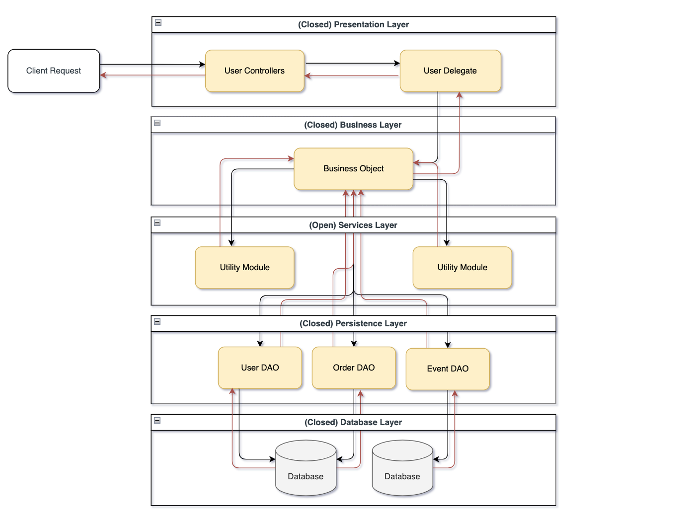

# Introduction

Enterprise software is all about cleanliness and reusability. And as developers and engineers across the industry have preached the gospel of clean code and scalability, it's no surprise that
we've seen the emergence of software architectural patterns and their applications. As mentioned on Red Hat, "the architectural pattern captures the design structures of various systems and elements
of software so that they can be reused."

It was on my first Agile development team that I was introduced to an architectural pattern that particularly stuck with me - the Layered Architecture, or as it was referred to then, the N-tier Architecture.

# What are Layered Architectures?

The layered architecture is (probably) the most common architectural pattern used in the industry and is the de-facto standard for many traditional enterprise codebases - and for good reason. The structure of a
layered architecture is naturally hierarchical and enforces a clear *separation of concerns*. This results in a codebase that is both easily testable and easy to introduce to new developers as it isn't overly complex.

It involves separating your code into "layers" with each layer serving a distinct purpose. The number of layers isn't concrete and can be variable towards what fits best for your application and needs. However, in
most business applications there will be four standard layers: Presentation, Business, Persistence, and Database.

- The Presentation layer would be responsible for any and all components that are directly involved with handling the use interface and browser communciation.
- The Business layer would be responsbile for any logic, calculation, or rules, that are associated with the business needs and domain.
- The Persistence layer would be responsible for executing queries and commands against your persistent storage, whether this is a relational database, NoSQL, or any other form of DB. Your Persistence layer would handle any direction communications.
- The Database layer represents the level directly at your databases above.

With each layer in the architecture, there's a degree of abstraction that is created around the logic and work that needs to be done within that layer.

For example, your Presentation layer shouldn't need to worry, or even care, about what business computations are being done in the Business layer. It's single purpose is to display the information, handle interaction, and any other interface level tasks associated.

Likewise, your Business layer shouldn't need to worry or care about where this data is coming from, or how it's being fetched. All it needs to do is perform the specific manipulations on the data that are required by the business, knowing that the Persistence layer will provide the correct data in the correct format.

 

By creating a clear separation of concerns, with each layer having a single and isolated function, the codebase becomes easily testable as every component's scope is is contained within its own layer.

# Bypassing Layers using Open Layers

One thing to note about the layered architecture we've shown so far is that all of the layers are closed. This means that inorder to traverse from the Presentation layer to the Persistence layer, we **must** go through the Business layer.

 

But in certain cases, it makes sense to "open" a layer to be traversed through by a client request. A common example, and one that would've been quite applicable to my first workplace, would've been a layer containing shared services. This could be a layer containing some utility components that are shared by your Business layer (formatting utilities, logging capabilities, etc.).

Logically, this shouldn't need to be accessed by the Presentation layer and would likely be placed right under the Business layer. However, it wouldn't make sense to force every business request moving from Presentation to business to persistence, to traverse through this layer. This is actually considered a common pitfall of layered architectures and is resolved by opening the layer to be passed through.

 

Leveraging the concept of open and closed layers helps define the relationship between architecture layers and request flows and also provides designers and developers with the necessary information to understand the various layer access restrictions within the architecture. Failure to document or properly communicate which layers in the architecture are open and closed (and why) usually results in tightly coupled and brittle architectures that are very difficult to test, maintain, and deploy. (Richards, 2015)

# Example Architecture of an Online Store

Let's walk through an example of how a layered architecture could be leveraged to implement an online store.

Suppose we were following the path of a User request placing an Order for some product that you're selling. Your Presentation layer might have some controllers accepting client requests for certain pieces of information. 

These controllers have no idea in which tables the data is stored, or how to query the data, all it knows is that the client wants some of the information and that it needs to return and display it accordingly.

The handling controller could then forward the request to a delegate component for the User that's responsible for knowing which components of the Business layer are required and how to access them.

Once arriving into the Business layer we'll create a Business Object representing the aggregation of all the data related to the business request for the User, which in our case would relate to the User information, Order information, and any other information related to the Event of the purchase.

Perhaps we'd also like to log some information, maybe the timezone of the User (for which we'd need a formatting utility) and the quantity purchased for some metrics calculations (for which we'd need a logging utility). For these components, we'll draw from the opened services layer just below.

The data being returned to the Business layer is coming from a few DAOs (Data Access Objects) that execute the necessary queries to fetch the correct data for the User, Order, and Event.

The DAOs return the data up to the Business Objects where we'll perform some computation, and then back to the Presentation layer where we'll display the Order information for the User.

From a tech perspective, there are tons of ways to implement these data access components. They could be POJOs/POCOs encapsulating raw JDBC or SQL Server queries. They could also be implemented as ADOs in a .NET stack taking advantage of ADO.NET and easy-to-use DataTable classes. The options are unlimited.

# Architecture Sinkhole Anti-Pattern

There is an important consideration when implementing layered architectures and that is of the architecture sinkhole anti-pattern. This anti-pattern describes layered architectures that simply pass the request down the layers without any processing or logic performed at each layer.

For example a client requests some data, it goes through the Business layer without any processing, to the Persistence layer, executes a simple select query, and just passes this back up to Presentation without any transformations/manipulations/business-logic.

Every layered architecture will experience sinkhole requests to some degree (it simply isn't possible to avoid them entirely). Thus, a good rule of thumb would be to follow the Pareto principle with 20% of client requests being sinkhole requests and 80% of the requests having associated business logic.

# Conclusion

In conclusion, the layered architecture is a great starting point for any project, especially if you don't know which architecture would be best to follow. It presents a strong separation of concerns that leads to an easily testable, and developer-friendly codebase. However, layered architectures also tend to be monolithic in nature and difficult to deploy due to the entire application being deployed as a single unit. For example, making a change in the Presentation layer or Business layer, should not affect the Persistence layer in any way. But when deploying the change to a production (or staging/development/any) environment, the application would still have to be deployed as a whole.

For anyone interested in learning more about layered architectural patterns, or any other, there's a great textbook by O'Reilly that I'll link [here](https://www.oreilly.com/library/view/software-architecture-patterns/9781491971437/) as further reading. Thanks! :)

# References
- Richards, M. (2015). Software Architecture Patterns. O'Reilly Media, Inc. 
- Richards, M., &amp; Ford, N. (2020). Fundamentals of Software Architecture. EBSCO Industries Inc. 