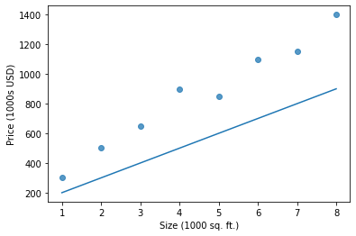
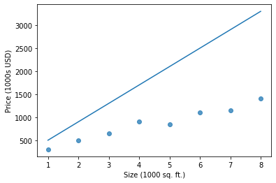

Suppose you're trying to model the relationship between the size of a house in square feet and its market value. Maybe your friend
came to you knowing only the square footage of their home, asking for an accurate estimate of what the property might be worth. Or maybe
they're looking to renovate the home for some extra selling value and are wondering how much more they would receive per square foot.

# Linear Regression

For linear regression, our model in this case would look something like $$f_{w,b}(x^i) = w * x^i + b$$ since we only have one input
feature and are attempting to model a single target variable.

## Mean Squared Error (MSE)

When evaluating the performance of the model, we need an equation to represent the cost. Our cost function J will represent the difference
between our prediction, that is, the output of $f_{w,b}(x^i)$ and the real value of the housing price at $x^i$ for all x values in our training
set. Below is the function J that we will be using to represent the cost with one variable.

$$J(w,b) = \frac{1}{m} \sum\limits_{i = 0}^{m-1} (f_{w,b}(x^{(i)}) - y^{(i)})^2 \tag{1}$$ 
 
- $f_{w,b}(x^{(i)})$ is our prediction for example $i$ using parameters $w,b$.  
- $(f_{w,b}(x^{(i)}) -y^{(i)})^2$ is the squared difference between the target value and the prediction.   
- These differences are summed over all the $m$ examples and divided by `m` to produce the cost, $J(w,b)$.

The above cost function is known as the Mean Squared Error (MSE) since we're computing the squared error across all training examples and
averaging them to result in $J(w,b)$.

In practice, it's often an improvement to use the One Half MSE function as it results in some cleaner values but both functions will work for
the purposes of univariate linear regression.

$$J(w,b) = \frac{1}{2m} \sum\limits_{i = 0}^{m-1} (f_{w,b}(x^{(i)}) - y^{(i)})^2 \tag{2}$$

## Cost Function Intuition & Example

Ultimately, the goal of linear regression is to minimize $J(w,b)$. Since our model $f_{w,b}(x^i)$ predicts the cost of a house
based on the square footage `x`, ultimately our goal would be to find some parameters w and b that results in the smallest cost J.

To illustrate what this means, let's observe what $f_{w,b}(x^i)$ might look like for a fixed b and variable parameter w. We'll begin by defining
some training data below.

```
x_train = np.array([1.0, 2.0, 3.0, 4.0, 5.0, 6.0, 7.0, 8.0])
y_train = np.array([300.0, 500.0, 650.0, 900, 850, 1100, 1150, 1400])
```

The definition of our cost function will be shown below. Input variables `x` and `y` are `ndarray`s representing our `x_train` and `y_train` lists.
The inputs `w` and `b` represent the parameters of the above equation.

```
def compute_cost(x, y, w, b): 
    m = x.shape[0] 
    
    cost_sum = 0 
    for i in range(m): 
        f_wb = w * x[i] + b   
        cost = (f_wb - y[i]) ** 2  
        cost_sum = cost_sum + cost  
    total_cost = (1 / (2 * m)) * cost_sum  

    return total_cost
```

Suppose we fix `b=100` and have a variable `w=100` and graph the list resulting from all $f_{w,b}(x^i)$ values.


")

Suppose we fix `b=100` and have a variable `w=400` and graph the list resulting from all $f_{w,b}(x^i)$ values.


")

## Visualizing $J(w,b)$ in 3D

Now consider having both parameters w and b as variable and plotted on the axies x and y. Imagine a vertical axis z that represents the cost
$J(w,b)$ for any point (w,b) on the plane below it. Visualizing the cost function in this 3D space will result in a convex function (a kind of
bowl shaped graph). And this "bowl shape" would be present for <strong>all</strong> univariate linear regression models.

 for all points w and b")

#### Image Credits
- Banner: https://vitalflux.com/mean-square-error-r-squared-which-one-to-use/
- 3D J(w,b): https://www.analyticsvidhya.com/blog/2021/03/data-science-101-introduction-to-cost-function/