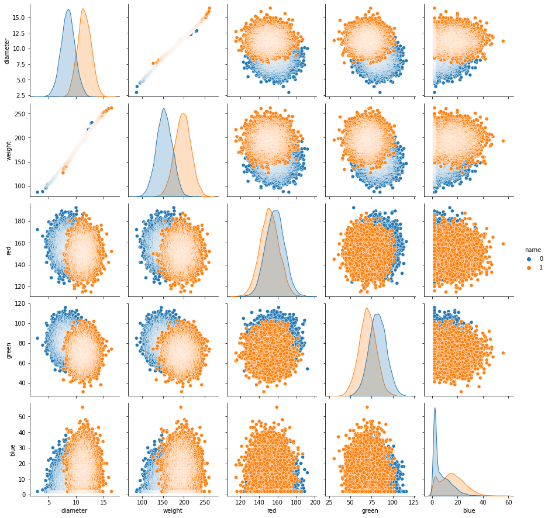

# Introduction

This is part 2/2 of the Citrus Classification series covering logistic regression. It builds on the information covered in the [previous post](./../orange-grapefruit-logistic-regression-pt1/) which covers the math behind logistic regression. 
Here I'll give a super concise implementation using sci-kit learn but I would love to do a post covering classification from scratch in the future as I did with linear regression.

# The Data

The dataset has the following information consisting of 5 features and the targets `name` that can be one of two classes `orange` or `grapefruit`.

| # | Column   | Non-Null Count | Dtype   |   |
|---|----------|----------------|---------|---|
| 0 | name     | 10000 non-null | object  |   |
| 1 | diameter | 10000 non-null | float64 |   |
| 2 | weight   | 10000 non-null | float64 |   |
| 3 | red      | 10000 non-null | int64   |   |
| 4 | green    | 10000 non-null | int64   |   |
| 5 | blue     | 10000 non-null | int64   |   |

# Python Implementation

Although `orange` and `grapefruit` are very human readable values, we're going to do some preprocessing (label encoding / feature scaling) to make the data easier to work with.

## Label Encoding

```
ORANGE = 0
GRAPEFRUIT = 1

def encode_labels(string_label: str) -> int:
    return 0 if string_label == 'orange' else 1

df['name'] = df['name'].apply(encode_labels)
```

## Visualizing the Data

Now I'll use a pairplot to take a look at the relationships between features at a high level. Notice that the orange points representing the grapefruit tend be heavier and have larger diameters.



## Feature Scaling

Next I'll use the `StandardScaler` from sklearn to normalize the data using z-score normalization. There are other methods of feature scaling such as absolute maximum scaling and min-max scaling that I could cover in a separate post dedicated to feature engineering.

Z-score normalization works by subtracting the mean and dividing by the standard deviation for each value in the dataset. Once the data is normalized the mean of the resulting data would be 0 whereas the standard deviation would be 1.

```
X_data = df.drop('name', axis=1).copy()
X_data = StandardScaler().fit_transform(X_data)
```

Now we'll do some split validation so we can properly evaluate our model later.

```
y_data = df['name'].copy()

X_train, X_test, y_train, y_test = train_test_split(X_data, y_data, train_size=0.8, random_state=20)
```

## Fitting the model

Fitting the model is actually a lot simpler than anything covered before. Sklearn's `LogisticRegression` classifier lets us fit the model to our normalized data using the logistic loss cost function and L2 regularization.

Using high level libraries like sklearn are a double edged sword. On one hand they allow for rapid model development, provide a shared community behind the package, and solid developer support. However, on the other hand it too easily alows developers to implement a model without fully understanding its workings. This can lead to poor model selection, an inability to debug why your model is underperforming, and other problematic roadblocks in the long run. Therefore, it is worthwhile to brush up on some of your calculus and understand the math.

For a brief overview, if you haven't already, check out the [previous post](./../orange-grapefruit-logistic-regression-pt1/).

```
lr_model = LogisticRegression()
lr_model.fit(X_train, y_train)
```

## Evaluating the model

To make a prediction using the model I use the `predict()` method on the training set.

```
y_pred = lr_model.predict(X_train)
print("Prediction on training set:", y_pred)
```

But the LogisticRegression class has a handy method `score()` that lets you run `predict()` on the data and returns the mean accuracy with respect to y.

```
# Checking Accuracy
print("Accuracy on testing set:", lr_model.score(X_test, y_test))
```

Scoring the model against the test set we get the following classification accuracy:

> Accuracy on testing set: 0.943

# References
* Buitinck, L., Louppe, G., Blondel, M., Pedregosa, F., Mueller, A., Grisel, O., Niculae, V., Prettenhofer, P., Gramfort, A., Grobler, J., Layton, R., Vanderplas, J., Joly, A., Holt, B., &amp; Varoquaux, G. (2013, September 1). API design for Machine Learning Software: Experiences from the scikit-learn project. arXiv.org. Retrieved October 11, 2022, from https://arxiv.org/abs/1309.0238 
* Speech and Language Processing (3rd ed. draft) Dan Jurafsky and James H. Martin. Speech and Language Processing. (n.d.). Retrieved from https://web.stanford.edu/~jurafsky/slp3/ 
* McAdams, J. (2020, January 8). Oranges vs. grapefruit. Kaggle. Retrieved from https://www.kaggle.com/datasets/joshmcadams/oranges-vs-grapefruit 